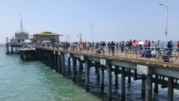

# Map Tools Workshop

This self-paced tutorial covers Leaflet, OpenStreetMap, MapBox and GeoJSON. Each lesson is saved as a commit. Examine the commit history to view changes in the code. Notes on each lesson with step by step instructions are saved in this README.md file.

* [Map Tools Workshop GitHub Repo](https://github.com/uclaioes/map-tools-workshop/)
* [Map on GitHub Pages](https://uclaioes.github.io/map-tools-workshop/)

## Links

* [Visual Studio Code](https://code.visualstudio.com/)
* [Atom](https://atom.io/)
* [Firefox](https://www.mozilla.org/en-US/firefox/new/)
* [Github](https://github.com)
* [UCLA IoES on Github](https://github.com/uclaioes)
* [GeoJSON](http://geojson.org/)
* [Leaflet - a JavaScript library for interactive maps](https://leafletjs.com/)
* [Icon Documentation - Leaflet](https://leafletjs.com/reference-1.3.4.html#icon)
* [Popup documentation - Leaflet](https://leafletjs.com/reference-1.3.4.html#popup)
* [OpenStreetMap](https://www.openstreetmap.org/#map=4/38.01/-95.84)
* [OpenStreetMap Tile Servers](https://wiki.openstreetmap.org/wiki/Tile_servers)
* [Mapbox](https://www.mapbox.com/)
* [Maki Icons | By Mapbox](https://www.mapbox.com/maki-icons/)
* [You Might Not Need jQuery](http://youmightnotneedjquery.com/)
* [data.world](https://data.world/)
* [UCLA IoES on data.world](https://data.world/uclaioes)
* [Los Angeles County Neighborhoods - Datasets - UCLA Geoportal](https://gis.ucla.edu/geodata/dataset/los-angeles-county-neighborhoods)
* [United States Wind Turbine Database](https://data.world/quanticdata/united-states-wind-turbine-database)

## Set up your project
* Install a text editor. Visual Studio Code or Atom are good choices and are free.
* Download Leaflet to your computer. 
	* There is an option to use a hosted version, but for this exercise, I want you to download the Leaflet JavaScript library to install locally.
* Create a folder named  `lib`  and copy the downloaded leaflet library to it. 
* Create a folder named  `js`  and create  `map.js`  in it for your JavaScript.
* Create a folder named  `css`  and create a `styles.css` file in it to use for your project’s CSS Stylesheet.
* Create folders  `img`, `json` and `icons`.
* Create an `index.html`.
* Your project folder structure should look like this:

```
├── css
│   └── styles.css
├── icons
├── img
├── index.html
├── js
│   └── map.js
├── json
└── lib
    └── leaflet
        ├── images
        ├── leaflet-src.esm.js
        ├── leaflet-src.esm.js.map
        ├── leaflet-src.js
        ├── leaflet-src.js.map
        ├── leaflet.css
        ├── leaflet.js
        └── leaflet.js.map
```

* In your  `index.html` add links to  `leaflet.js`, `leaflet.css`, `styles.css` and `map.js`. 
* When you’re done it should look like this, but feel free to add more html and text to build out your project home page. Please refer to this repos `index.html` page for a more complete version.

```
<!DOCTYPE html>

<html lang="en">
  <head>
    <meta charset="utf-8" />

    <title>Map Tools Workshop</title>
    <meta
      name="description"
      content="Leaflet, MapBox and GeoJSON Mapping Tools Workshop"/>
    <meta name="author" content="Your Name" />
    
    <script src="lib/leaflet/leaflet.js"></script>
    <link rel="stylesheet" href="lib/leaflet/leaflet.css">
    <link rel="stylesheet" href="css/styles.css">
  </head>

  <body>
    <div id="map"></div>
    <script src="js/map.js"></script>
  </body>
</html>
```

## Create your first map
* In `map.js`  add this code with a geo location and zoom level. I chose 12. You can find a decimal geo location at Wikipedia. Search for a place and on the right hand side if there are latitude and longitude coordinates, click it to go to a page where the decimal version should be.

`var map = L.map('map').setView([34.069444, -118.445278], 12);`

* Add this line to load a base map from OpenStreetMap. OpenStreetMap is good for local testing but not for production. For production we’ll use MapBox.
```
L.tileLayer(
  'https://a.tile.openstreetmap.org/{z}/{x}/{y}.png', {
  attribution: 'Map data &copy; OpenStreetMap contributors'
}).addTo(map);
```

* Your  `map.js` should look like this: 

```
var map = L.map('map').setView([34.069444, -118.445278], 12);

L.tileLayer(
  'https://a.tile.openstreetmap.org/{z}/{x}/{y}.png', {
  attribution: 'Map data &copy; OpenStreetMap contributors'
}).addTo(map);
```

* Write this CSS in your `styles.css` 

```
#map {
  height: 70vh;
  width: 100%;
}
```

* Open  `index.html`  in Firefox browser and your map should display. 
* Congratulations! You’ve created your first map.

To complete this lesson, create a new GitHub repository and make an Initial Commit with all your project files to put it in version control. In the next lesson, we’ll add a marker to your map.

## Add a marker to your map.
* In this section we’ll add a marker to your map. 
* Get a geolocation for something on your map. In my example, I choose the Santa Monica pier which has a geo decimal value of `34.008611, -118.498611`
* Go into map.js and write this line to add a marker to your map.
`var marker = L.marker([34.008611, -118.498611]).addTo(map)`
* Refresh your web page and you’ll see the marker on the map.

### Add multiple markers
You could copy and paste this line, over and over and swap out the coordinates, but that wouldn’t be as efficient as storing our coordinates in a *nested array* and iterate through it with a *for loop* for each set of coordinates. 
* Gather some more coordinates, like so:
```
	Santa Monica Pier [34.008611, -118.498611]
	UCLA [34.069444, -118.445278]
	Griffith Park Observatory [34.11856, -118.30037]
	Getty Museum [34.0775, -118.475]
	Topanga State Park [34.095278, -118.548889]
	Dodger Stadium [34.073611, -118.24]
	Los Liones Park [34.04708, -118.55993]
```

* Comment out the first marker and we’ll create a new variable called `parks`
* Copy and paste the geocoodinates making sure they all have brackets and commas except for the last line. It should look like this:
```
var parks = [
  [34.008611, -118.498611],
	[34.069444, -118.445278],
	[34.11856, -118.30037],
	[34.0775, -118.475],
	[34.095278, -118.548889],
	[34.073611, -118.24]
]
```

* Write a for loop. 
```
for (var i=0; i<parks.length; i++) {
  marker = new L.marker(parks[i]).addTo(map)
}
```

* Reload map to view

## Create a Popup 
* When user clicks on a marker a popup modal can display
* The popup can take html so both text and images can be used.
* [Popup documentation - Leaflet](https://leafletjs.com/reference-1.3.4.html#popup)
* Set minWidth to 300px on popup window to fit size of image. 

```
var popup = L.popup({
  minWidth: 300
}).setContent('<p>Santa Monica Pier</p>')

markersArray[0].bindPopup(popup)
```

* Create a markers array to have each marker be a unique value.
* For this sample we’re duplicating the text and image snippet for each marker. Challenge would be to convert this into an array and make it DRY

## Add custom markers
* Download Maki Icons
* Add to map.js the following code

```
var parkIcon = L.icon({
  iconUrl: 'icons/park.svg',
  className: 'svg-icon',
  iconAnchor: [10, 15],
  popupAnchor: [5, -15]
})
```

* Change `for` loop to load parkIcon

```
for (var i = 0; i < parks.length; i++) {
  markersArray[i] = new L.marker(parks[i], { icon: parkIcon }).addTo(map)
}
```


## Load a GeoJSON file into your leaflet project
* Go to UCLA GIS and download geojson file for [Los Angeles County Neighborhoods - Datasets - UCLA Geoportal](https://gis.ucla.edu/geodata/dataset/los-angeles-county-neighborhoods)
* Save to json folder in project
* Go to [You Might Not Need jQuery](http://youmightnotneedjquery.com/) to get vanilla JavaScript to load a json file.  I went with IE10 support, but you can select for IE8 or IE9 if you like.

```
// Step Seven
// Load geojson file

var request = new XMLHttpRequest()
request.open('GET', 'json/la-county-neighborhoods-v6.geojson', true)

request.onload = function() {
  if (this.status >= 200 && this.status < 400) {
    // Success!
    var geojsonData = JSON.parse(this.response)
    L.geoJson(geojsonData).addTo(map)
  } else {
    // We reached our target server, but it returned an error

  }
}

request.onerror = function() {
  // There was a connection error of some sort
}

request.send()
```

* Reload map and shows LA county neighborhood borders. 
* Next step is to create a custom geojson file and add five markers and load dynamically with AJAX.

### Create custom GeoJSON file
Next lesson....

#tutorial/maps
#maps